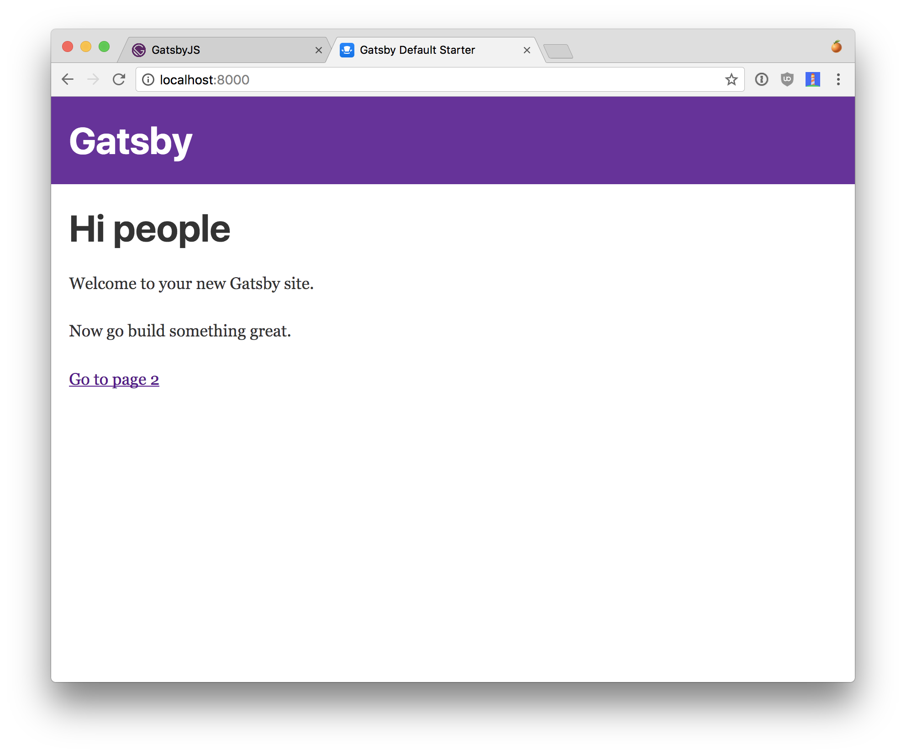
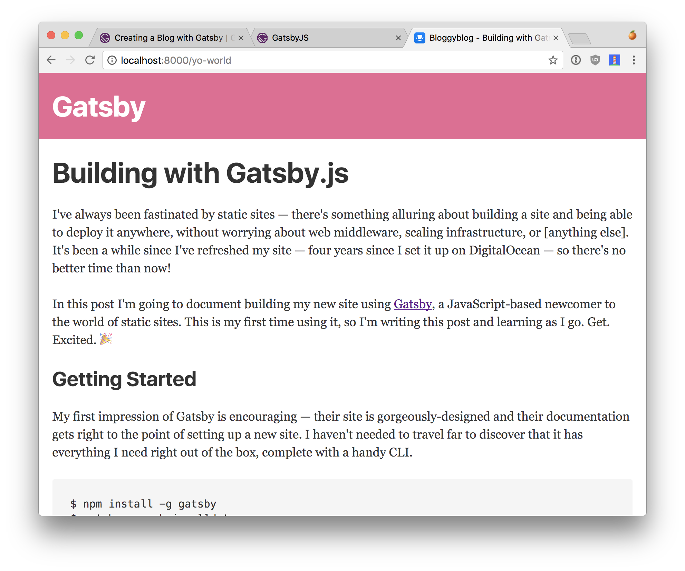

I've always been fascinated by static sites — there's something alluring about building a site and being able to deploy it anywhere, without worrying about web middleware, scaling infrastructure, managing databases, or any of the other fun pieces of modern web development.

It's been a while since I've refreshed my own personal site, so in the interest of [documenting learning](https://academy.realm.io/posts/droidcon-boston-chiu-ki-chan-how-to-be-an-android-expert/), I'm going to write this post while building a shiny new site using [Gatsby](https://www.gatsbyjs.org/), a JavaScript-based newcomer to the world of static sites. This is my first time using it, so I'm writing this post and learning as I go. Get. Excited. 🎉


## Getting Started

My first impression of Gatsby is encouraging — their site is gorgeously-designed and their documentation gets right to the point of setting up a new site. I haven't needed to travel far to discover that it has everything I need right out of the box, complete with a handy CLI.

```
$ npm install -g gatsby
$ gatsby new chrisvolldotcom
$ cd chrisvolldotcom
$ gatsby develop
```

Running the setup script is painless and presents me with a nicely-structured boilerplate project. Diving in, I'm already noticing a couple things:

1. There's almost no configuration. The project starts out with a small `gatsby-config.js` file with the project title and a minimal list of plugins.

2. Everything is templated out using React. Neat!

3. Gatsby has its own router. I don't immediately see any centralized routing logic, so my assumption is that adding a file to the `/src/pages` directory magically adds a route for it.

4. The console output mentions GraphQL. Interesting! I'm dying to see how this is used in the context of a static website.

Loading up the freshly-built site, I'm presented with a rather spartan page — the perfect blank canvas to build on:



Already I can tell that the developer experience is phenomenal. Gatsby comes with hot reloading right out of the box, so I can just dive right in.


## Setting up a blog

Let's find a way to render this blog post I'm writing. To the docs!

The docs are actually pretty light on this, so I'm my assumption is that implementing a blog has a very generalized solution, like building on support for loading markdown files. By good fortune, the Gatsby authors anticipated this, the first post on their blog describes [building a blog](https://www.gatsbyjs.org/blog/2017-07-19-creating-a-blog-with-gatsby/). How meta. 🤘

This post confirms my suspicion that this functionality isn't built right in. I won't repeat everything from that tutorial here, but there are a couple interesting takeaways:

- Gatsby has a plugin system sort of similar to webpack. If you want to use markdown files, for instance, you need to add the ability to load and parse them.

- Gatsby comes with built-in support for server-side rendering of React components. Get that SEO juice a-flowin'

- It uses Redux internally, and [exposes its action creators](https://www.gatsbyjs.org/docs/bound-action-creators/)

It works!



So far so good! But no weekend project would be complete without a little debugging... Error messages in Gatsby aren't always descriptive of the problem. For instance, I encountered an error [where the graphql schema failed to compile](https://github.com/gatsbyjs/gatsby/issues/1567). Turns out I'm just dumb and can't format dates, and it provided enough context to nudge me in the right direction.

And don't count on GitHub Pages if you plan to use a custom domain name! If you want offline mode, you'll need support for service workers, which require HTTPS; GitHub Pages [doesn't yet offer HTTPS](https://github.com/isaacs/github/issues/156) for custom domain names sadly — I found this out the hard way.

## Takeaways

- Gatsby and the community around it are incredible. By no means is it perfect — it came out of beta a month ago! — but I kept thinking, "🤔 I wish it could do...", only to discover that a plugin already exists with that exact functionality.

- Gatsby does a ton of magic behind the scenes. In some contexts I could see how this may be a problem, but the upsides of not having to think about offline mode, server-side rendering, bundle chunking, and other headaches are totally worth it. For my day job I love tinkering with webpack, but if I'm churning out a quick weekend project, I want to be able to iterate quickly.

- If you're familiar with React and the ecosystem around it, you'll feel right at home with Gatsby.

Trying it out is super easy — just [install the demo app](https://www.gatsbyjs.org/docs/) and dive right in. After only a couple days of work I was able to put together a pretty simple static blog. [Take a gander at the source code here](https://github.com/chrisvoll/chrisvolldotcom) to see how it works!
