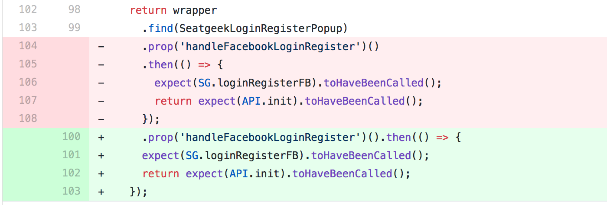
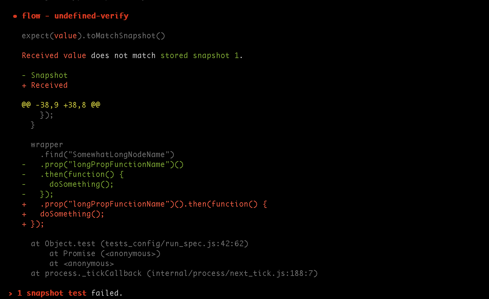
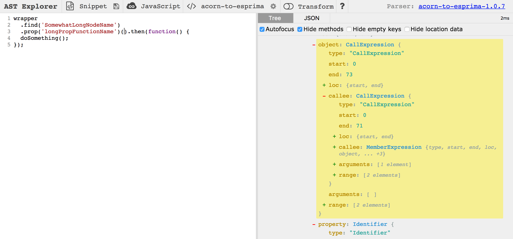
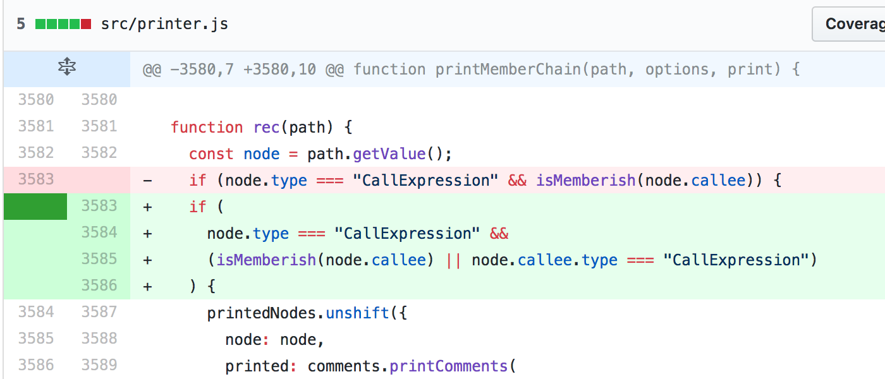

[Prettier](https://prettier.io/) has changed my life. I wanted to learn more about how it worked, so I decided to take on a [minor formatting bug](https://github.com/prettier/prettier/issues/2832) I found in the most recent release. I've been wanting to spend more time documenting how I approach problems and learn new things, and this post is the result of that process.


## So how does Prettier make my code, well, prettier?

Admittedly I only have a vague understanding of how Prettier works internally. What I know right now is that is has some means of parsing JavaScript (and other languages!) and reprinting it according to a predefined standard. In other words, magic, right?!

From the [docs](https://github.com/prettier/prettier#technical-details):

> The basic idea is that the printer takes an AST and returns an intermediate representation of the output, and the printer uses that to generate a string. The advantage is that the printer can "measure" the IR and see if the output is going to fit on a line, and break if not.

That sentence is a lot to grok, but the gist is that for code to be formatted, it's put through a pipeline that looks roughly like this:

1. Code is parsed and represented in a tree notation called an abstract syntax tree (AST). [AST Explorer](https://astexplorer.net/) has a fantastic interactive demonstration for what this looks like. It's really cool seeing how your code is understood by the parser, and how a deceptively simple example can expand into hundreds of nodes on the tree.

2. A `printer` uses that syntax tree to produce some kind of output that can be measured for length. I'm a little unclear on what the "intermediate representation" is or how that relates to the final output, but it's key to how Prettier works.

3. The `printer` determines what can fit on the line and introduces line breaks to fit within the limit.

This is a very simplified look, since Prettier does quite a bit more, like attempting to preserve some style choices that already exist in the code.


## A wild bug appears! 🦋

At SeatGeek we've been rolling out Prettier across our entire frontend codebase. I was upgrading it to a new version and came across a questionable change in one of our Enzyme tests:



It's harmless enough — the promise didn't make it onto a new line, and the indentation for the callback in the promise's call expression broke. But functionally it was still the same, so we proceeded with the upgrade and [filed an issue](https://github.com/prettier/prettier/issues/2832) with that context.

> Side note: filing issues for Prettier is amazing. Their [playground](https://prettier.io/playground/) has a really handy button that opens a GitHub issue with the input and output already filled in. The authors have clearly put a ton of thought into creating a really solid developer experience.


## A journey in fixing

Now that I have a moderately better understanding of how Prettier works internally, I'm ready to dive into the code. To kick it off, let's fork the repo, clone it, start it up, and write a unit test for this particular case.

Prettier uses jest for testing, so setup is painless.

```
yarn
yarn test
```

I see a couple warnings, but everything passes on the first run. Cool!

Figuring out where to put the test is honestly the first big challenge. I see tons of `jsfmt.spec.js` files in the test output, organized into directories. JavaScript tests seem to all have their own top-level directories, and other languages are filed away in subdirectories.

My test case seems to touch a few different areas, so should it go in the `function` directory? `arrows`? I don't know enough yet, so let's find an example pull request to borrow from. There are a couple candidates from the 1.7.0 release that reference member chains, and [#2786](https://github.com/prettier/prettier/pull/2786) in particular seems the most promising, pointing to `member` and `method-chain` tests. Now I'm on the right track 🌟

Just for fun, let's pull some levers and see how this breaks. I'll watch the tests with...

```
yarn test method-chain -- --watch
```

... and take a gander at `printer.js`. The size of the file is a little intimidating, but luckily the pull request from before gives me two starting points:

1. There's a method called `genericPrintNoParens` with a 2,500-line switch statement that contains instructions for each node type in an abstract syntax tree.

2. There's another method called `printMemberChain` that immediately jumps out to me. Props to whoever wrote the documentation, because I don't have to look far to understand exactly how it works:

```javascript
// We detect calls on member expressions specially to format a
// common pattern better. The pattern we are looking for is this:
//
// arr
//   .map(x => x + 1)
//   .filter(x => x > 10)
//   .some(x => x % 2)
//
// The way it is structured in the AST is via a nested sequence of
// MemberExpression and CallExpression. We need to traverse the AST
// and make groups out of it to print it in the desired way.
function printMemberChain(path, options, print) {
  // ...
}
```

Breaking this function is oddly satisfying, because I can watch the test results come back with new and interesting ways of formatting the test cases. But even better is that it confirms I'm in the right place, and I can see exactly which test files cover this.

The test cases are super simple. An entire file is fed through the formatter, and the results are stored in a jest snapshot. So if I want to test my case, all I have to do is add it to the most sensible file (`multiple-members.js` seems close enough), re-generate the snapshot, manually edit the snapshot with the desired output, and tweak the printer until the tests pass.



Sweet. So now that we have a test and know approximately where the issue is, it'll help to narrow down our bug. Let's take a look again at a simplified version of the code that's breaking:

```javascript
wrapper
  .find("SomewhatLongNodeName")
  .prop("longPropFunctionName")().then(function() {
  doSomething();
});
```

We can learn a lot about how this code is interpreted by looking at [how it's parsed in AST Explorer](https://astexplorer.net/#/gist/d364c8fe8d67aa7228afd30dd3c76a37/9ac722d8db8115f0e56098f37056a381bca04b6e):



The point where the formatting breaks is at these nested CallExpression nodes: `('longPropFunctionName')()`. Based on my understanding of `printMemberChain` from reading over its code and documentation, nesting CallExpressions is already supported, so there's a bug that's preventing it from working correctly.

I wanted to better understand the inputs and outputs for each part of the `printMemberChain` method, so I started logging variables at certain points. Surprisingly, `printMemberChain` was being called twice!

I was curious how it was handling the data, so I logged out the output of the first phase, which takes a nested AST structure and flattens it. The first call to `printMemberChain` grouped the first part of my test case (`wrapper.find(x).prop(y)`), and the second call handled the end (`().then(...)`).

Reading over the recursive method, I realized why: the process of flattening the abstract syntax tree was only looking for two types of chains:

- Member-to-Member: `a.b.c`
- Member-to-Call: `a.b()`

But not Call-to-Call: `a.b()()`. So I added in a condition to allow nested CallExpressions, and the tests passed!



In all, I spent around four hours getting up to speed on how Prettier works, tracking down the bug, and [filing a pull request](https://github.com/prettier/prettier/pull/2990) (and a [small followup](https://github.com/prettier/prettier/pull/2991)) with the one-line fix. Even though the change was so simple, I feel like I came away from this with a much better understanding of its internals, and have a huge amount of respect for everything that Prettier's authors have done to vastly improve the developer experience of the frontend ecosystem.
